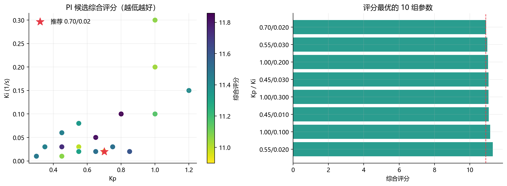
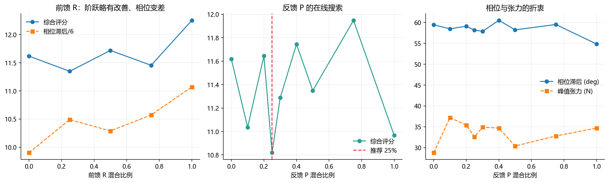
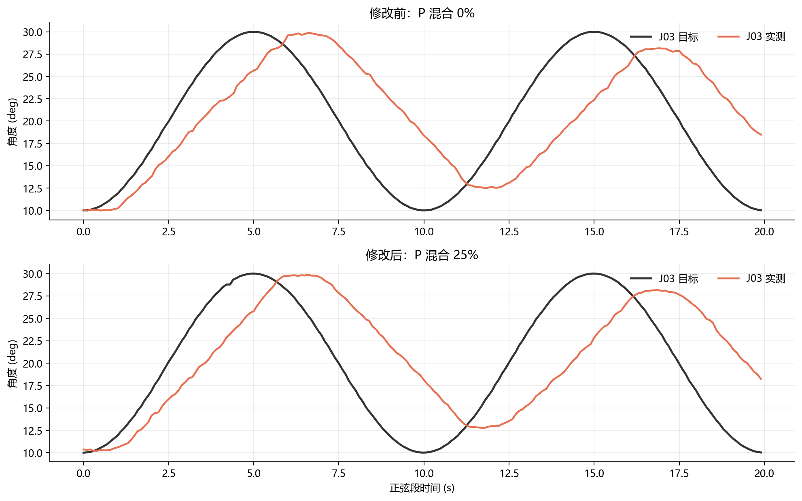

# 五腱四关节控制自动调参与矩阵优化报告（2026-07-19）

## 结论先行

- 局部综合推荐：`Kp=0.70`、`Ki=0.02 1/s`、前馈 `R blend=0`、反馈 `P blend=0.25`。
- `P blend=0.25` 是局部推荐，不应在尚未完成广域安全验证前设为全局上电默认。
- 单纯增大 Ki 不能解决正弦相位滞后；剩余误差主要是频率相关带宽/延迟，而不是静态矩阵的单一比例错误。
- 1° 内不计超调时，推荐参数在三姿态阶跃中平均有效超调接近 0°，但 J02 的稳态误差仍偏大。

## 1. 控制结构与被优化参数

当前控制分为前馈、PI 任务反馈、任务空间投影和独立零空间张力分配。前馈使用 `R`，反馈使用 `P`，二者必须分开：

```text
ΔL_ff = 200 R (q_ref - q_entry)
ΔL_PI = 200 P [Kp e + Ki ∫e dt]
ΔL_task = (R R⁺)(ΔL_ff + ΔL_PI)
x_requested = x_entry + ΔL_task + α n
x_cmd = x_now + clip(x_requested - x_now, -20, 20)
```

本轮没有用张力 ΔF 做前馈；张力仅用于零空间分配和安全保护。

## 2. Kp/Ki 搜索

共汇总 21 组 PI 候选。评分最小点为 `Kp=0.70`、`Ki=0.020`，综合评分 10.900。
高 Ki 候选并没有稳定降低相位滞后，部分候选反而增加张力峰值和阶跃误差。



## 3. 为什么以及怎样优化矩阵

1. 先固定 PI，分别做四个关节的 ±5° 独立阶跃；用稳定段的实际电机位移和实际角度增量拟合局部 5×4 映射。
2. 保留腱绳物理稀疏结构，并用小岭回归向原矩阵约束，避免把噪声拟合成不存在的耦合。
3. 不直接整矩阵替换，而用 0%～100% 混合比例逐点实测。
4. 分开扫描前馈 R 和反馈 P。R 改动使相位变差，因此最终 R 保持原值；P 的 25% 混合综合评分最低。

原 P 综合评分 11.618，P 混合 25% 后 10.819（下降 6.9%）；阶跃稳态误差由 0.837° 降至 0.670°。





### 局部推荐反馈矩阵 P（mm/rad）

`P_final = 0.75 P_base + 0.25 P_identified`：

```text
[ 4.1725,  5.4962,  0.0000,  0.0000]
[-3.9191,  5.5054,  0.0000,  0.0000]
[-1.3541, -3.0758,  5.9870,  0.0000]
[ 1.4860, -2.7433,  0.0000,  4.7815]
[ 0.0000, -5.5046, -6.0297, -5.6743]
```

## 4. 最终参数与边界

| 参数 | 推荐值 | 说明 |
|---|---:|---|
| Kp | 0.70 | 三姿态局部综合值 |
| Ki | 0.02 1/s | 再增大不能消除相位滞后 |
| 前馈 R blend | 0 | 拟合 R 的混合使正弦相位更差 |
| 反馈 P blend | 0.25 | 局部评分最佳；暂不设全局上电默认 |
| 主机试验保护 | 40 N | 本轮保守验证线 |
| 单周期电机有限差分 | 20 counts/10 ms | 高频相位滞后的重要来源之一 |

## 5. 仍需改进的地方

- 静态 P 矩阵不能抵消频率相关的 0.20 Hz 相位滞后。下一阶段应考虑目标速度前馈/相位超前，而不是继续提高 Ki。
- J02 在三姿态中的阶跃稳态误差约 1.7°～2.0°，低频正弦幅值比也最低，需要单独辨识 J02 通道或增加列增益，而不能把全局 Kp 一起放大。
- 若加入 D 项，必须先对角速度低通并做很小的增益扫描；当前证据更支持速度前馈而非直接高增益 D。
- 广域姿态必须采用可行域搜索和分段路径，不能直接跳到 27 个预设点。
