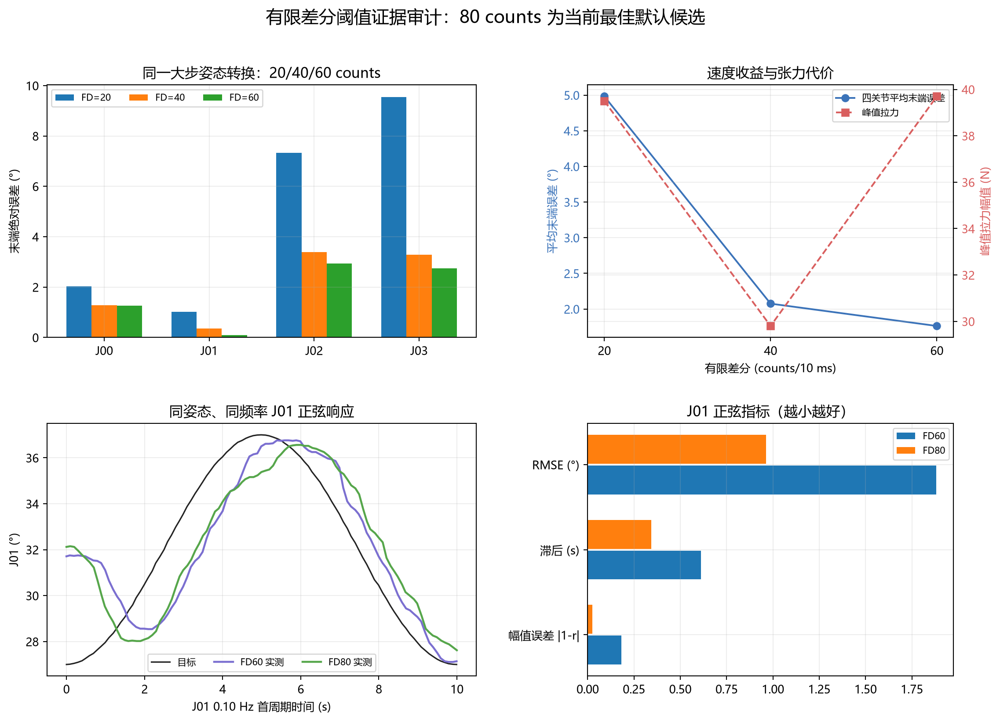
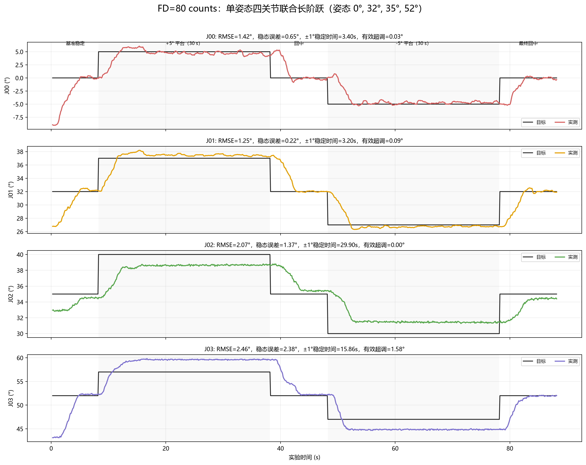
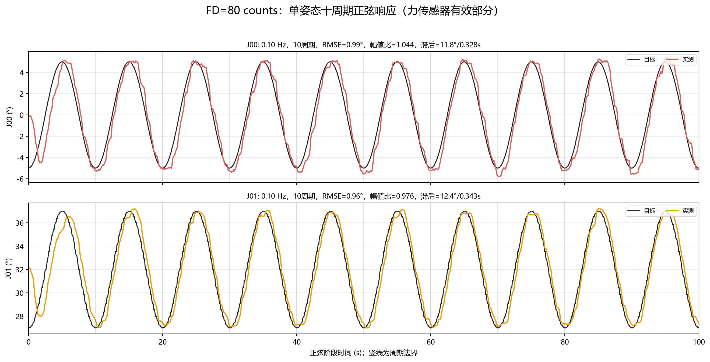
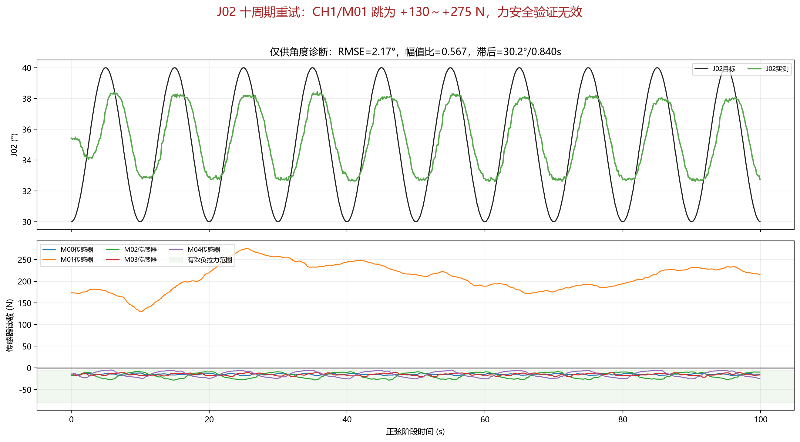

# 有限差分阈值选择与最终控制实验报告

日期：2026-07-19

候选阈值：20、40、60、80 counts/10 ms
最终推荐：80 counts/10 ms

## 摘要

本报告审计现有 20/40/60 counts 同目标转换数据，以及同姿态、同频率的 60/80 counts J01 正弦数据，并汇总 80 counts 长阶跃和十周期正弦实验。结论是：80 counts 是当前数据支持的最佳默认候选，但由于 CH1/M01 力传感器在 J02 正弦测试前发生硬件异常，80 counts 的 J02/J03 和广域姿态验证尚未完整完成。因此结论是“当前最佳工程默认值”，不是全工作空间严格全局最优。

## 1. 实验配置

最终 FD80 单姿态实验采用：

```text
姿态: [J00,J01,J02,J03] = [0,32,35,52] deg
Kp: 0.70
Ki: 0.02 1/s
rblend: 0.00
pblend: 0.25
参考角最大变化: 0.25 deg/10 ms
电机有限差分: 80 counts/10 ms
实验张力允许范围: 5 - 80 N
```

阶跃流程为：基准 8 s、四关节同时 +5 deg 保持 30 s、回中 10 s、四关节同时 -5 deg 保持 30 s、最终回中 10 s。

正弦流程为：每次激励一个关节，其他关节保持目标；振幅 +/-5 deg，频率 0.10 Hz，持续 100 s，即 10 个完整周期。

## 2. 20/40/60 counts 同目标转换

历史数据使用同一目标转换，可直接比较末端误差和峰值拉力：

| FD | 四关节平均末端绝对误差 | 峰值拉力 |
|---:|---:|---:|
| 20 | 4.983 deg | 39.5 N |
| 40 | 2.075 deg | 29.8 N |
| 60 | 1.762 deg | 39.7 N |

从 20 增加到 40 counts 后，平均末端误差下降约 58%；从 40 增加到 60 counts 后继续下降约 15%。20 counts 在记录末段仍有约 96.7% 的周期处于有限差分激活状态，说明该值明显成为速度瓶颈。

## 3. FD60 与 FD80 的同姿态、同频率直接比较

J01 在姿态 `[0,32,35,52] deg`、频率 0.10 Hz 下的结果：

| 指标 | FD60 | FD80 | 变化 |
|---|---:|---:|---:|
| RMSE | 1.880 deg | 0.964 deg | 降低 48.7% |
| 幅值比 | 0.819 | 0.976 | 更接近 1 |
| 相位滞后 | 0.612 s | 0.343 s | 降低 43.9% |
| 峰值拉力 | 26.3 N | 22.6 N | 未增加 |

这是当前最有说服力的阈值证据，因为姿态、激励关节和频率一致。FD80 在该条件下同时改善 RMSE、幅值和相位，且没有付出更高峰值张力代价。



## 4. FD80 长阶跃

CSV 自检得到 `max(|cmd-now|)=80 counts`，确认求解器内层和 ControlTask 外层均实际采用 80 counts。

| 关节 | RMSE | 稳态误差 | +/-1 deg 稳定时间 | 有效超调 |
|---|---:|---:|---:|---:|
| J00 | 1.416 deg | 0.648 deg | 3.398 s | 0.030 deg |
| J01 | 1.245 deg | 0.218 deg | 3.202 s | 0.095 deg |
| J02 | 2.072 deg | 1.369 deg | 29.903 s | 0.000 deg |
| J03 | 2.463 deg | 2.379 deg | 15.856 s | 1.580 deg |

峰值拉力为 31.4 N。J00/J01 能在约 3.3 s 进入 +/-1 deg；J02/J03 的长保持揭示出局部矩阵误差和稳态偏差，不能通过继续增大有限差分解决。



## 5. FD80 十周期正弦

有效完成的数据：

| 关节 | 周期数 | RMSE | 幅值比 | 相位滞后 | 峰值拉力 |
|---|---:|---:|---:|---:|---:|
| J00 | 10 | 0.991 deg | 1.044 | 11.8 deg / 0.328 s | 19.4 N |
| J01 | 10 | 0.964 deg | 0.976 | 12.4 deg / 0.343 s | 22.6 N |

两个关节在十周期内具有良好重复性，幅值比接近 1，相位滞后约 0.33 s。



## 6. J02 力通道故障与数据隔离

J02 重试完成十周期，角度诊断得到 RMSE 2.165 deg、幅值比 0.567、滞后 0.840 s。但 CH1/M01 同时显示非物理的 +130.3 - +275.4 N，现场静态值约 +222.5 N，而正常受拉读数应为负数。

因此该段只能用于角度趋势观察，不能用于评价张力安全、零空间分配或 FD80 的综合性能。J03 未继续执行。



## 7. 阈值决策

最终选择 80 counts，理由如下：

1. 20 counts 明显成为速度瓶颈；
2. 40 到 60 counts 仍能降低同目标转换误差；
3. 在同姿态、同频率 J01 正弦中，80 相比 60 将 RMSE 降低约 48.7%，相位滞后降低约 43.9%；
4. 已完成的 FD80 阶跃与 J00/J01 十周期正弦峰值拉力分别为 31.4、19.4、22.6 N，低于实验 80 N 上限；
5. 80 counts 对应的理论最大电机目标变化率为 8000 counts/s，但实际运动仍受参考角 25 deg/s 限速、目标差和电机本体动态共同限制。

不继续增加到 100 或更高的原因是当前没有对应的张力安全数据，而且 J02/J03 的主要问题是映射和稳态误差，不是电机有限差分不足。继续增大阈值可能只会提高瞬时张力和机械冲击。

## 8. 结论边界与后续验证

80 counts 可作为当前控制框架的最终默认值。严格表述为：

> 在现有 20/40/60/80 counts 数据中，80 counts 在已验证姿态和 J00/J01 正弦通道上给出最佳跟踪性能，且已完成测试的张力安全；其全工作空间最优性尚未完成验证。

力传感器修复后应补做：

1. 当前姿态 J02、J03 各 0.10 Hz、十周期；
2. 至少三个分散姿态的四关节 +/-5 deg 阶跃；
3. 至少三个分散姿态的四关节 0.05/0.10/0.20 Hz 正弦；
4. 对每次试验检查 5 - 80 N 张力、RMSE、幅值比、相位滞后和交叉耦合；
5. 若 J02/J03 仍偏差明显，优先重新辨识分段 R/P，而不是继续增大有限差分。

## 9. 数据与脚本

- FD20/40/60 对比：`output/control_autotune_20260719/31_fd60_transition_summary.json`
- FD80 阶跃：`run_data/direct_autotune/fd80_single_pose_20260719/combined_step_long_fd80.csv`
- FD80 J00：`run_data/direct_autotune/fd80_single_pose_20260719/sine_j0_0.10hz_10cycles.csv`
- FD80 J01：`run_data/direct_autotune/fd80_single_pose_20260719/sine_j1_0.10hz_10cycles.csv`
- FD80 J02 故障段：`run_data/direct_autotune/fd80_single_pose_20260719/sine_j2_0.10hz_10cycles_retry.csv`
- 阈值对比脚本：`tools/control_validation/build_final_fd_comparison.py`
- FD80 作图脚本：`tools/control_validation/plot_fd80_single_pose_long.py`
