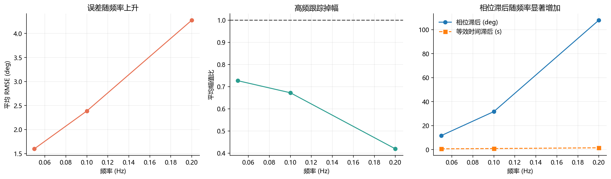
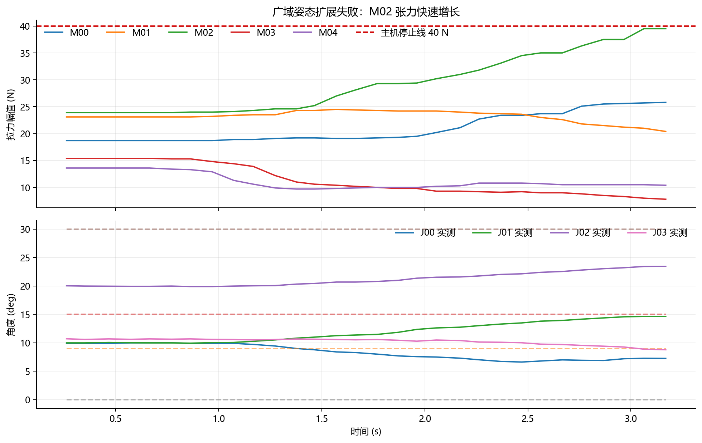
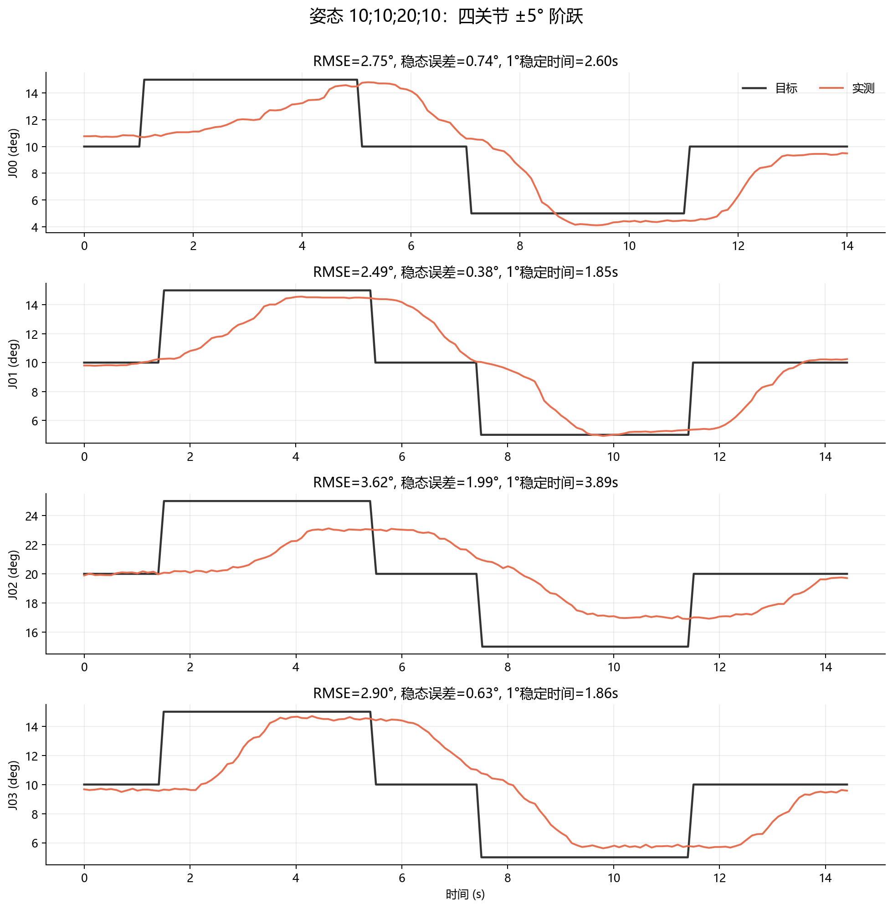
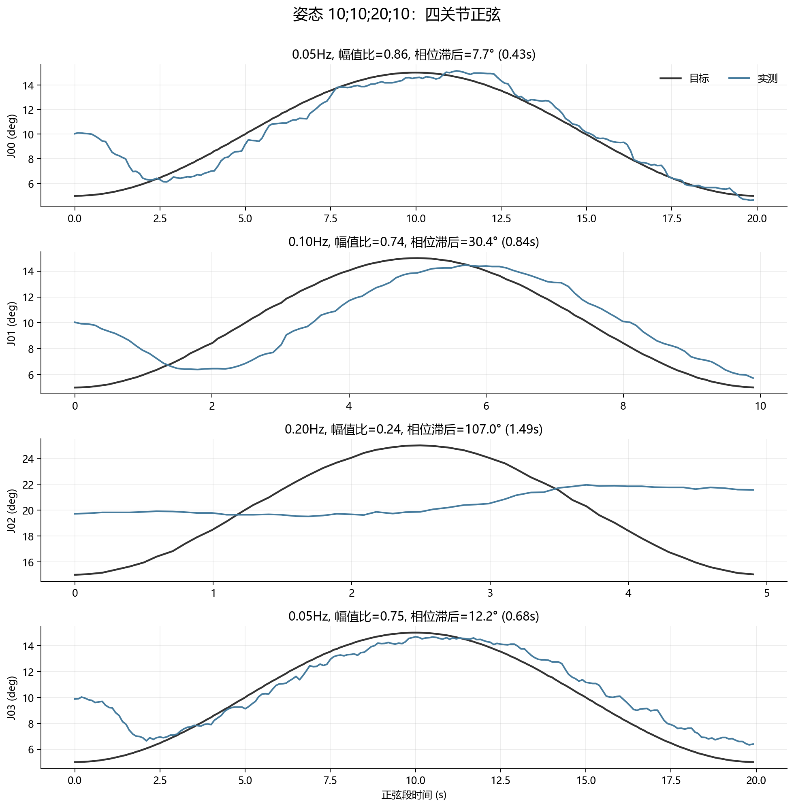
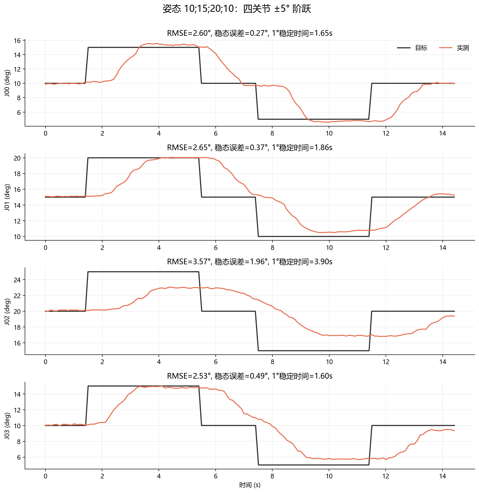
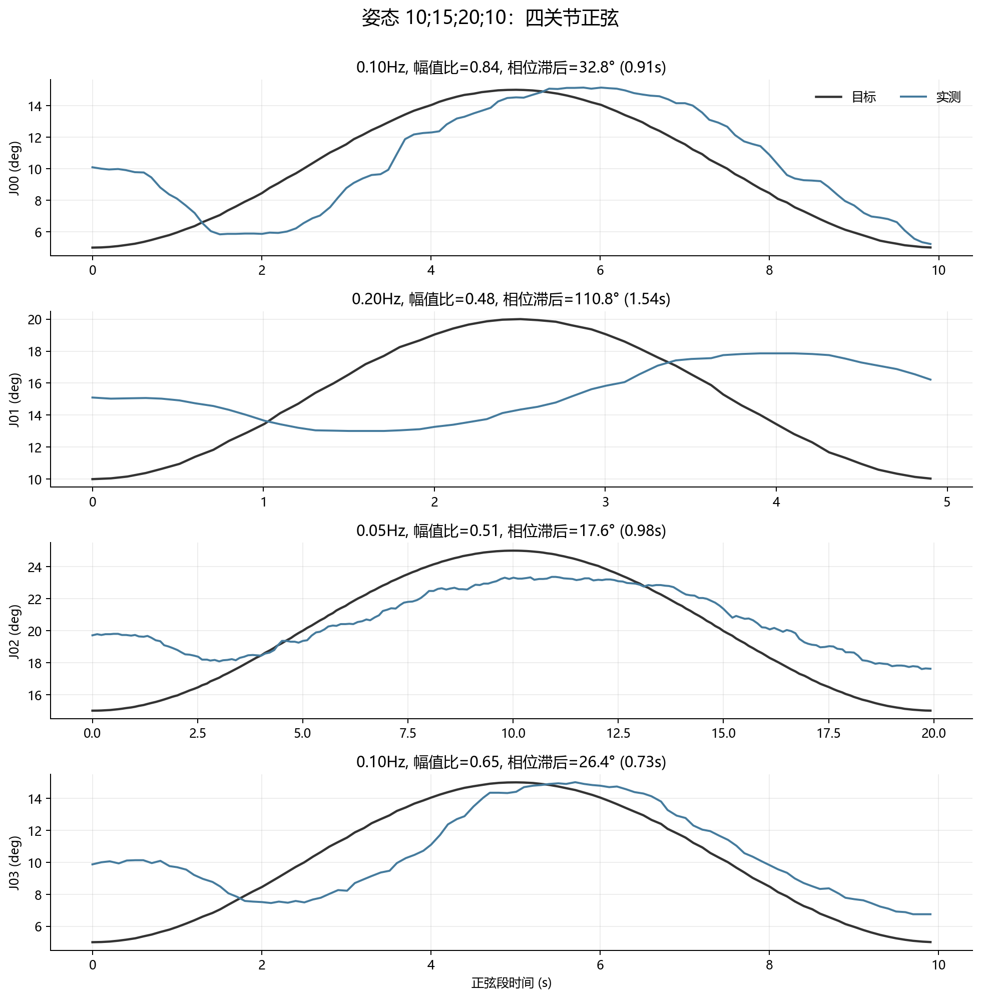
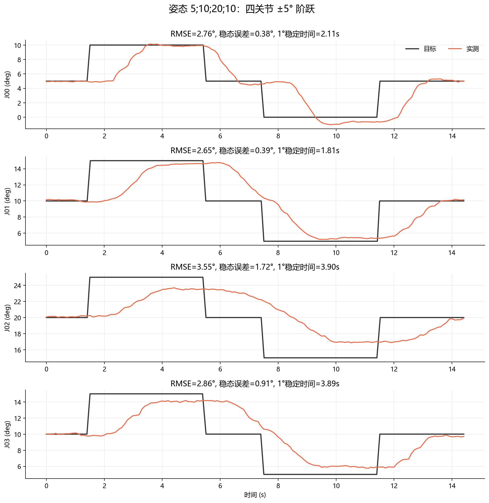
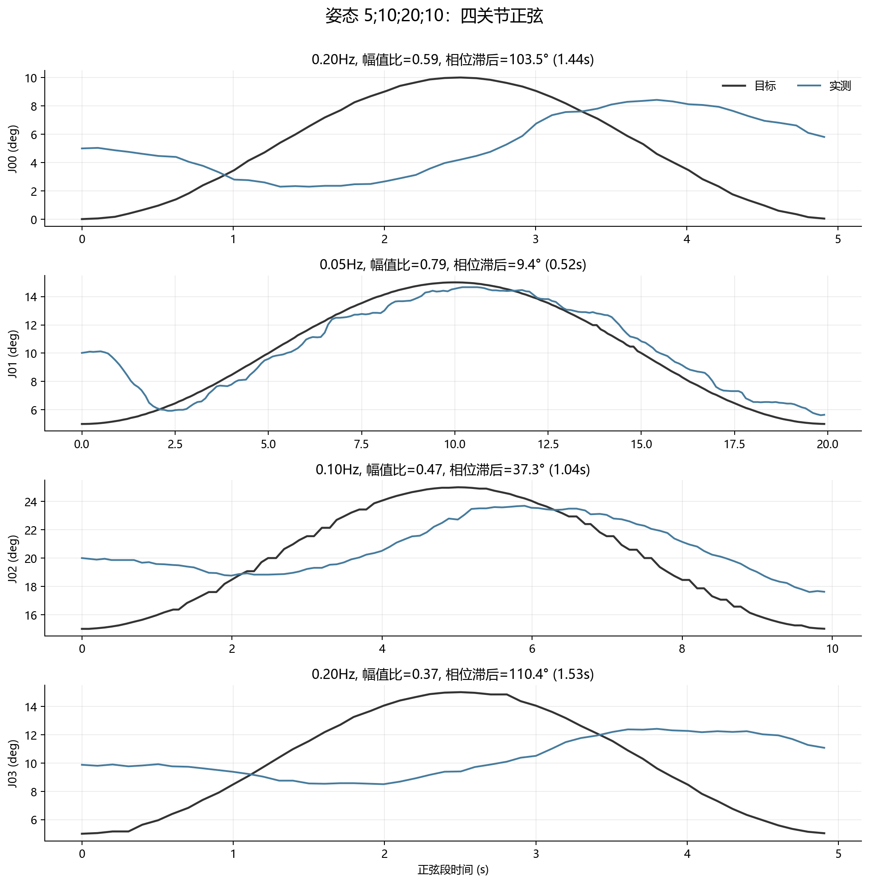

# 三姿态阶跃与正弦验证报告（2026-07-19）

## 测试范围

安全完成三个姿态：`[10,10,20,10]°`、`[10,15,20,10]°`、`[5,10,20,10]°`。每个姿态包含四个关节的 ±5° 双向阶跃和四个关节的一周期正弦，共 24 项。J01 目标和实测始终大于 0°。

阶跃平均 RMSE 为 2.911°，平均稳态误差 0.853°，按 1° 带宽的平均稳定时间 2.576s，有效超调 0.001°。
正弦平均 RMSE 为 2.754°，全程峰值张力 36.0N。

## 频率特性

| 频率 | 平均 RMSE | 平均幅值比 | 平均相位滞后 | 等效时间滞后 |
|---:|---:|---:|---:|---:|
| 0.05 Hz | 1.598° | 0.727 | 11.7° | 0.651s |
| 0.10 Hz | 2.386° | 0.673 | 31.7° | 0.881s |
| 0.20 Hz | 4.276° | 0.420 | 107.9° | 1.499s |

## 广域扩展的安全失败

尝试从基准附近移动到 `[9,15,30,0]°` 时，M02 张力在约 3.2s 内由 24.6N 上升到 39.5N，并在下一采样达到 40N 主机停止线。所有 host tensionbias 均为 0，因此该问题来自任务姿态/耦合，而不是额外零空间偏置。该姿态及后续广域点未继续执行。

## 每个姿态的完整曲线

### 姿态 1: `10;10;20;10°`

### 姿态 2: `10;15;20;10°`

### 姿态 3: `5;10;20;10°`

## 建议的下一轮实验

1. 先在这三个安全姿态增加 0.02/0.05/0.10/0.15/0.20Hz 扫频，辨识每个关节的带宽与纯延迟。
2. 对 J02 单独重辨识反馈矩阵第二列（程序索引 J02 为第 3 列），限制其余列不变。
3. 加入速度前馈后，先只在 0.10Hz 和 0.20Hz 比较相位，不改变零空间张力逻辑。
4. 用张力可行域引导姿态扩展：每次目标增量不超过 2°，预测/实测任一路超过 35N 就回退，禁止直接跨到广域目标。
