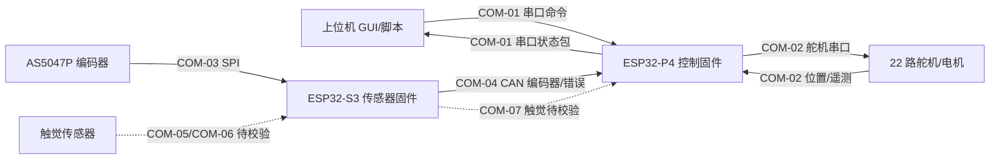

# 上手代码必读

本文只依据当前仓库中的代码、配置文件和构建文件整理。未读取、引用或总结既有 README、docs、doc、Markdown、txt、rst 等说明性文档。

确定性标记说明：

| 标记 | 含义 |
| -- | -- |
| 确定 | 代码、配置或构建入口中能直接确认 |
| 推测 | 能从命名、路径、调用关系推导，但缺少完整运行证据 |
| 待校验 | 代码中存在链路或协议片段，实际硬件、参数或两端闭环需要实测 |

## 1. 项目一句话概览

代码事实显示：该项目包含 ESP32-P4 侧下位控制固件、ESP32-S3 侧传感器/CAN 固件和上位机桌面程序；当前核心数据规模为 21 路关节/磁编码器数据、22 路舵机/电机通道、5 组触觉模块摘要数据。主要依据为 `ESP32-P4/main/app_main.cpp` 的 `app_main()`、`ESP32-P4/ServoBoardMain/SystemTask.cpp` 的 `System_Init()`、`ESP32-S3/System/System.ino` 的 `setup()`、`desktop/main.py` 和 `desktop/ui_main.py`。

## 2. 代码目录总览

| 目录路径 | 主要职责 | 运行端 | 关键入口文件 | 关键类、函数、任务或中断 | 判断依据 |
| -- | -- | -- | -- | -- | -- |
| `ESP32-P4/main` | ESP-IDF 工程入口，挂接 Arduino 运行时和 P4 主控代码 | ESP32-P4 | `app_main.cpp` | `app_main()` 调用 `initArduino()`、`System_Init()`、循环调用 `System_Loop()` | `ESP32-P4/main/app_main.cpp`、`ESP32-P4/main/CMakeLists.txt`、`ESP32-P4/main/idf_component.yml` |
| `ESP32-P4/ServoBoardMain` | P4 下位控制：串口上位通信、CAN 接收、舵机总线、角度解算、标定参数 | ESP32-P4 | `ServoBoardMain.ino`、`SystemTask.cpp` | `System_Init()`、`taskUpperComm()`、`taskCanComm()`、`taskSolver()`、`AngleSolver::update()` | `SystemTask.cpp`、`TaskSharedData.h`、`UpperCommTask.cpp`、`CanCommTask.cpp`、`AngleSolver.cpp` |
| `ESP32-P4/libraries/FTServo_Arduino` | 飞特/STS/SCS 舵机串口协议封装 | ESP32-P4 | 被 `ServoBusManager.cpp` include | `SMS_STS::SyncWritePosEx()`、`SCS::syncReadPacketTx()`、`SCSerial::writeBuf()` | `SCS.cpp`、`SMS_STS.cpp`、`SCSerial.cpp` |
| `desktop` | 上位机 GUI、串口收发、协议打包解析、手模型与标定文件读写 | 上位机 | `main.py`、`ui_main.py` | `HandController`、`LowerComputerComm`、`parse_frame()`、`build_angle_cmd()`、`HandControlUI` | `main.py`、`core_logic.py`、`comm_layer.py`、`protocol.py`、`ui_main.py`、`data_models.py` |
| `desktop/config` | 上位机几何、零点、腱保护配置 | 上位机 | JSON 配置文件 | `load_hand_geometry()`、`load_calib_zero_raw()`、`_load_tendon_calib()` | `hand_geo.json`、`calib_deg.json`、`tendon_manual_calib.json`、`hand_geometry.py` |
| `ESP32-S3/System` | S3 侧编码器读取、触觉占位、TWAI/CAN 转发、系统任务 | ESP32-S3 | `System.ino` | `Task_Encoders()`、`Task_CanBus()`、`Task_Tactile()`、`Task_SysMgr()`、`HalTWAI::sendEncoderData()` | `System.ino`、`Config.h`、`SystemTasks.cpp`、`EncodersTask.cpp`、`CanTask.cpp`、`HalEncoders.cpp`、`HalTWAI.cpp` |
| `ESP32-S3/paxini_all_read_newboard.ino`、`ESP32-S3/paxini_all_read_2.12`、`ESP32-S3/Standalone` | Paxini 触觉 SPI 独立读取和测试 | ESP32-S3，测试/独立 | `.ino` 文件 | `readOne()`、`crc8()`、`selectGroup()` | 文件内 SPI 引脚、`CMD_READ=0xFB`、目标地址 `1008`、读取长度 `15` |
| `ESP32-P4/SetupMotors`、`ESP32-P4/ReadLoad`、`ESP32-P4/PalmBoardMain` | 舵机 ID 设置、负载读取、空壳手掌板示例 | P4 或 Arduino 工具，待确认 | `.ino` 文件 | `setup()`、`loop()`、`SMS_STS::RegWriteAction()`、`ReadLoad()` | `SetupMotors.ino`、`ReadLoad.ino`、`PalmBoardMain.ino` |
| `ESP32-P4/libraries/ServoManager` | 旧版或备用舵机管理封装 | 待确认 | `ServoManager.cpp` | `ServoManager::scanServos()`、`emergencyStopAll()`、`findLimit()` | 未被 `ESP32-P4/main/CMakeLists.txt` 的 `APP_SRCS` 引入，代码中存在 TODO |
| `tactile_sim_visualizer` | 触觉点阵可视化模拟 | 上位机，独立模拟 | `simulate_tactile_dot_matrix.py` | `TactileSignalGenerator`、`DotMatrixVisualizer` | 文件内 `FINGER_NAMES`、`FrameData`、模拟数据生成逻辑 |

## 3. 当前代码中出现的数据总览

### 3.1 规模、映射和全局维度

| 数据名 | 数据含义 | 类型或结构体 | 单位 | 生产者 | 消费者 | 存储位置 | 更新频率 | 来源文件和关键位置 | 确定性 |
| -- | -- | -- | -- | -- | -- | -- | -- | -- | -- |
| `ENCODER_TOTAL_NUM` | 关节/磁编码器数量 | 宏 | 个 | 编译期配置 | P4、S3 任务和协议 | `21` | 固定 | `ESP32-P4/ServoBoardMain/TaskSharedData.h`、`ESP32-S3/System/Config.h` | 确定 |
| `SERVO_TOTAL_NUM` | P4 控制的舵机/电机通道数 | 宏 | 个 | 编译期配置 | `AngleSolver`、上位机协议 | `22` | 固定 | `TaskSharedData.h`、`protocol.py` 的 `MOTOR_COUNT=22` | 确定 |
| `TACTILE_GROUP_NUM` | 触觉组数 | 宏 | 组 | 编译期配置 | S3 触觉、P4 CAN、上位机解析 | `5` | 固定 | `TaskSharedData.h`、`ESP32-S3/System/Config.h`、`protocol.py` | 确定 |
| `TACTILE_SUMMARY_BYTES` | 触觉摘要 payload 长度 | 宏 | 字节 | 编译期配置 | P4 串口上报、上位机解析 | `45` | 固定 | `TaskSharedData.h`、`protocol.py` | 确定 |
| `jointMotorMap` | 21 个关节到 22 个舵机中的主舵机映射 | `JointServoBinding[21]` | 总线号、ID | `System_Init()` | `AngleSolver` | 全局数组 | 初始化一次 | `SystemTask.cpp` | 确定 |
| `joint16SecondaryMotor` | J16 第二舵机映射 | `JointServoBinding` | 总线号、ID | `System_Init()` | `AngleSolver::runJointMode()` | 全局变量 | 初始化一次 | `SystemTask.cpp`、`AngleSolver.cpp` | 确定 |
| `motorMap` | 22 个电机通道到总线/舵机 ID 的映射 | `MotorServoBinding[22]` | 总线号、ID | `System_Init()` | `ServoBusManager`、`AngleSolver` | 全局数组 | 初始化一次 | `SystemTask.cpp` | 确定 |
| `MOTOR_TO_JOINT_INDEX` | 上位机 22 电机通道到 21 关节索引映射 | Python list | 索引 | `ui_main.py` | UI 显示和控制 | 模块常量 | 固定 | `desktop/ui_main.py` | 确定 |

### 3.2 控制指令类数据

| 数据名 | 数据含义 | 类型或结构体 | 单位 | 生产者 | 消费者 | 存储位置 | 更新频率 | 来源文件和关键位置 | 确定性 |
| -- | -- | -- | -- | -- | -- | -- | -- | -- | -- |
| `targetAngles[21]` | 目标关节角度 | `float[21]` | 度 | P4 串口命令 `CMD_ANGLE_CTRL` | `AngleSolver::runJointMode()` | `TaskSharedData_t` | 收到上位机命令时 | `UpperCommTask.cpp`、`AngleSolver.cpp` | 确定 |
| `targetMotorPositions[22]` | 直控电机单圈目标 | `int32_t[22]` | 脉冲/计数 | `CMD_MOTOR_POS`、`CMD_MOTOR_POS_SWEEP` | `AngleSolver::runDirectMotorMode()` | `TaskSharedData_t` | 收到上位机命令时 | `UpperCommTask.cpp`、`AngleSolver.cpp` | 确定 |
| `targetMotorAbsPositions[22]` | 直控电机多圈绝对目标 | `int32_t[22]` | 脉冲/计数 | `CMD_MOTOR_POS_ABS` | `AngleSolver::runDirectMotorMode()` | `TaskSharedData_t` | 收到上位机命令时 | `UpperCommTask.cpp`、`protocol.py` | 确定 |
| `controlMode` | 控制模式：关节角度或电机直控 | `uint8_t` | 枚举 | 串口命令解析 | `AngleSolver` | `TaskSharedData_t` | 命令触发 | `TaskSharedData.h`、`UpperCommTask.cpp` | 确定 |
| `controlEnabled` | 控制输出使能 | `bool` | 布尔 | `CMD_START`、`CMD_STOP`、`CMD_RESET` | `AngleSolver` | `TaskSharedData_t` | 命令触发 | `UpperCommTask.cpp`、`AngleSolver.cpp` | 确定 |
| `joint_command_token`、`motor_command_token` | 命令新鲜度标记 | `uint32_t` | 计数 | 串口命令解析 | `AngleSolver` | `TaskSharedData_t` | 命令触发 | `TaskSharedData.h`、`UpperCommTask.cpp`、`AngleSolver.cpp` | 确定 |
| `tendon_guard_config` | 腱保护启用、方向、阈值 | 结构体数组 | 计数 | 上位机 `build_tendon_guard_cmd()` | `AngleSolver` | `TaskSharedData_t` | 命令触发 | `UpperCommTask.cpp`、`protocol.py`、`ui_main.py` | 待校验 |

### 3.3 关节、编码器和角度数据

| 数据名 | 数据含义 | 类型或结构体 | 单位 | 生产者 | 消费者 | 存储位置 | 更新频率 | 来源文件和关键位置 | 确定性 |
| -- | -- | -- | -- | -- | -- | -- | -- | -- | -- |
| `RemoteSensorData_t.encoderValues[21]` | S3 发来的原始磁编码器值 | `uint16_t[21]` | 0..16383 计数 | P4 `taskCanComm()` | `AngleSolver::update()` | `canRxQueue` | CAN 接收触发 | `TaskSharedData.h`、`CanCommTask.cpp` | 确定 |
| `RemoteSensorData_t.errorFlags[21]` | 每路编码器错误码 | `uint8_t[21]` | 错误码 | S3 `HalTWAI::sendErrorStatus()`、P4 重组 | `AngleSolver`、上位机状态 | `canRxQueue`、`sensorErrorFlags` | S3 每 5 个 CAN 周期有错时发送 | `HalTWAI.cpp`、`CanCommTask.cpp` | 确定 |
| `MappedAngleData_t.angleValues[21]` | 映射后的关节角度计数 | `int16_t[21]` | 0..16383 计数，断连为 `0x7FFF` | `AngleSolver::mapEncoderToAngle()` | P4 上报、上位机显示 | `mappedAngleQueue` | `taskSolver()` 每 10 ms 尝试更新 | `AngleSolver.cpp`、`UpperCommTask.cpp`、`protocol.py` | 确定 |
| `g_encoderDirection[21]` | 编码器方向 | `int8_t[21]` | `1` 或 `-1` | 编译期表 | 标定和角度映射 | 全局数组 | 固定 | `CalibrationTask.cpp` | 确定 |
| `g_encoderMaxRawManual[21]` | 手工最大编码器值 | `uint16_t[21]` | 原始计数 | 编译期表 | `initManualCalibrationForTest()` | 全局数组 | 初始化一次 | `CalibrationTask.cpp` | 确定 |
| `rawAngles[21]` | S3 读取的编码器原始值 | `uint16_t[21]` | 0..16383 或 `0xFFFF` | `HalEncoders::readAll()` | `EncodersTask`、`HalTWAI::sendEncoderData()` | `EncoderData_t` | 200 Hz | `HalEncoders.cpp`、`EncodersTask.cpp` | 确定 |

### 3.4 电机、舵机、驱动器相关数据

| 数据名 | 数据含义 | 类型或结构体 | 单位 | 生产者 | 消费者 | 存储位置 | 更新频率 | 来源文件和关键位置 | 确定性 |
| -- | -- | -- | -- | -- | -- | -- | -- | -- | -- |
| `ServoAngleData_t.servoAngles[22]` | 舵机多圈位置 | `int32_t[22]` | 脉冲/计数 | `ServoBusManager::syncReadPositions()` | P4 上报、UI 显示、控制内环 | `servoAngleQueue` | `taskSolver()` 每轮分相读取 | `ServoBusManager.cpp`、`AngleSolver.cpp` | 确定 |
| `ServoAngleData_t.servoRawPositions[22]` | 舵机单圈原始位置 | `int16_t[22]` | 0..4095 附近计数 | `ServoBusManager::syncReadPositions()` | P4 上报、UI 显示 | `servoRawQueue` | `taskSolver()` 每轮分相读取 | `ServoBusManager.cpp`、`UpperCommTask.cpp` | 确定 |
| `ServoTelemetryData_t.speed/load/voltage/temperature` | 舵机速度、负载、电压、温度 | 数组 | 代码未统一标注单位 | `ServoBusManager::syncReadPositions()` | P4 上报、上位机解析 | `servoTelemetryQueue` | 随舵机读取 | `TaskSharedData.h`、`ServoBusManager.cpp`、`protocol.py` | 待校验 |
| `PIDParams` | 外环和内环 PID 参数 | 结构体 | 代码未标注单位 | `System_Init()` | `AngleSolver` | `AngleSolver` 成员 | 初始化一次 | `SystemTask.cpp`、`AngleSolver.h` | 确定 |
| `j16DualFault` 相关状态 | J16 双舵机一致性保护 | 布尔、计数 | 计数 | `AngleSolver::runJointMode()` | 控制输出保护、调试上报 | `AngleSolver` 成员 | 每 10 ms | `AngleSolver.cpp` | 确定 |

### 3.5 传感器和触觉数据

| 数据名 | 数据含义 | 类型或结构体 | 单位 | 生产者 | 消费者 | 存储位置 | 更新频率 | 来源文件和关键位置 | 确定性 |
| -- | -- | -- | -- | -- | -- | -- | -- | -- | -- |
| `RemoteTactileData_t.values[45]` | P4 接收的触觉摘要 | `uint8_t[45]` | fx/fy int8，fz uint8 的打包值 | P4 CAN 触觉重组逻辑 | P4 串口上报、上位机解析 | `tactileQueue` | CAN 触觉帧齐套时 | `TaskSharedData.h`、`CanCommTask.cpp`、`UpperCommTask.cpp`、`protocol.py` | 待校验 |
| `TactileData_t.groups[5]` | S3 侧每组 A/B/C 三传感器三轴值 | 结构体 | 代码未标注单位 | `HalTactile::update()` | `Task_Tactile()`、`HalTWAI::sendTactileSummary()` | `HalTactile` 成员 | 当前 `Task_Tactile()` 未调用 `update()` | `HalTactile.h`、`HalTactile.cpp`、`TactileTask.cpp` | 待校验 |
| Paxini 读取 payload | 独立触觉 SPI 读取的 15 字节 payload | 字节数组 | fx/fy/fz | 独立 `.ino` 的 `readOne()` | 串口打印或本地变量 | 局部数组 | 约 1000 ms 刷新 | `paxini_all_read_newboard.ino`、`paxini_all_read_2.12` | 待校验 |

### 3.6 标定、零点、限位和映射参数

| 数据名 | 数据含义 | 类型或结构体 | 单位 | 生产者 | 消费者 | 存储位置 | 更新频率 | 来源文件和关键位置 | 确定性 |
| -- | -- | -- | -- | -- | -- | -- | -- | -- | -- |
| `JointCalibrationConfig` | 单关节标定策略参数 | 结构体 | 度、负载、时间 | `buildDefaultCalibrationProfile()` | `runSingleJointCalibration()`、手工配置加载 | 全局配置 | 初始化一次 | `JointCalibrationProfile.cpp`、`CalibrationTask.cpp` | 确定 |
| `g_jointCalibResult[21]` | 固件侧关节标定结果 | 结构体数组 | 原始计数、度 | `loadManualCalibrationFromProfile()` | `AngleSolver::mapEncoderToAngle()` | 全局数组 | 初始化一次 | `CalibrationTask.cpp`、`AngleSolver.cpp` | 确定 |
| `calib_zero_raw_cache[21]` | 上位机下发的零点原始值缓存 | `float[21]` | 原始计数 | `CMD_CALIB_DATA` | 当前未找到明确使用点 | `TaskSharedData_t` | 命令触发 | `UpperCommTask.cpp`、`TaskSharedData.h` | 待校验 |
| `calib_deg.json.zero_encoder_raw` | 上位机保存的 21 路零点 | JSON array | 原始计数 | `calibration.py`、`hand_geometry.py` | `HandController.initialize()` 下发 | `desktop/config/calib_deg.json` | 文件读写 | `core_logic.py`、`calibration.py`、`hand_geometry.py` | 待校验 |
| `JOINT_TARGET_MAX_DEG_BY_INDEX` | UI 关节角度上限 | Python list | 度 | `ui_main.py` | UI 滑条和目标限制 | 模块常量 | 固定 | `ui_main.py` | 确定 |

### 3.7 通信、状态机、错误码和调试数据

| 数据名 | 数据含义 | 类型或结构体 | 单位 | 生产者 | 消费者 | 存储位置 | 更新频率 | 来源文件和关键位置 | 确定性 |
| -- | -- | -- | -- | -- | -- | -- | -- | -- | -- |
| `PACKET_*` | P4 到上位机串口包类型 | 宏/常量 | 命令字 | P4、上位机协议 | `UpperCommTask`、`protocol.py` | 常量 | 固定 | `UpperCommTask.cpp`、`protocol.py` | 确定 |
| `CMD_*` | 上位机到 P4 串口命令 | 宏/常量 | 命令字 | 上位机协议 | `UpperCommTask` | 常量 | 固定 | `UpperCommTask.cpp`、`protocol.py` | 确定 |
| `JointDebugData_t` | 指定关节控制调试数据 | 结构体 | 度、脉冲、毫秒 | `AngleSolver` | P4 上报、UI 调试 | `jointDebugQueue` | `taskSolver()` 中生成 | `TaskSharedData.h`、`AngleSolver.cpp`、`UpperCommTask.cpp` | 确定 |
| `calibrationUIStatus` | P4 上报的 UI 标定状态 | 枚举 | 状态码 | `UpperCommTask`、标定代码 | 上位机 | 全局变量 | 命令或标定触发 | `CalibrationTask.h`、`UpperCommTask.cpp` | 待校验 |
| `overload_fault_bitmap`、`reverse_release_bitmap` | 故障和反向释放状态 | `uint32_t` | 位图 | `AngleSolver` | P4 上报、上位机 UI | `TaskSharedData_t` | 每轮控制循环 | `AngleSolver.cpp`、`UpperCommTask.cpp` | 待校验 |

### 3.8 上位机输入输出数据

| 数据名 | 数据含义 | 类型或结构体 | 单位 | 生产者 | 消费者 | 存储位置 | 更新频率 | 来源文件和关键位置 | 确定性 |
| -- | -- | -- | -- | -- | -- | -- | -- | -- | -- |
| `HandModel` | 上位机手状态聚合模型 | Python class | 多种 | `LowerComputerComm._process_packets()` | UI、模式脚本 | 内存对象 | 串口包触发 | `data_models.py`、`comm_layer.py` | 确定 |
| `hand_geo.json` | 手部几何和手指角度索引 | JSON | mm 或索引，代码未统一标注 | 配置文件 | `hand_geometry.py`、UI 绘制 | 配置文件 | 启动加载 | `desktop/config/hand_geo.json`、`hand_geometry.py` | 确定 |
| `tendon_manual_calib.json` | 上位机保存的腱保护配置 | JSON | 计数 | UI 读写 | `build_tendon_guard_cmd()` | 配置文件 | UI 操作触发 | `ui_main.py`、`protocol.py`、配置文件 | 待校验 |
| `VideoCapture` | 本地摄像头画面 | OpenCV 对象 | 图像帧 | `ui_main.py` 扫描摄像头索引 0..4 | UI 显示 | 内存对象 | UI 定时刷新 | `ui_main.py` | 确定 |

## 4. 数据流向总览

图中所有实线表示代码中两端格式基本能对上但仍需要硬件实测；虚线表示当前代码存在明显缺口或格式冲突。

| 流向编号 | 起点 | 终点 | 中间模块 | 传输的数据内容 | 协议或接口 | 相关文件、函数、变量 | 当前代码证据 | 是否能从代码确认闭环跑通 | 需要实测确认的点 |
| -- | -- | -- | -- | -- | -- | -- | -- | -- | -- |
| DF-01 | 上位机 `HandController`/UI | P4 `TaskSharedData_t` | `LowerComputerComm`、`protocol.py`、`taskUpperComm()` | 角度目标、电机目标、启停、重置、流模式、腱保护 | 见 `docs/通信.md` 的 COM-01 和 COM_FRAME_PC_TO_P4_COMMAND | `core_logic.py`、`comm_layer.py`、`protocol.py`、`UpperCommTask.cpp` | 命令字和 payload 长度两端基本一致 | 待校验 | 串口口名、921600 波特率、P4 是否持续接收、`CMD_TENDON_GUARD` 的符号解析 |
| DF-02 | S3 编码器任务 | P4 控制算法 | `HalEncoders`、`EncodersTask`、`HalTWAI`、`taskCanComm()` | 21 路编码器原始值和错误码 | 见 `docs/通信.md` 的 COM-03、COM-04、COM_FRAME_CAN_ENCODER、COM_FRAME_CAN_ERROR_DETAIL | `HalEncoders.cpp`、`EncodersTask.cpp`、`HalTWAI.cpp`、`CanCommTask.cpp` | CAN ID、字节序、数量在 S3 和 P4 代码中对得上 | 待校验 | CAN 线序、终端电阻、S3/P4 TWAI 引脚、编码器 SPI 硬件模式 |
| DF-03 | P4 `AngleSolver` | 上位机 `HandModel` | `mappedAngleQueue`、`taskUpperComm()`、`parse_sensor_payload()` | 21 路映射角度计数、断连哨兵 | 见 `docs/通信.md` 的 COM-01 和 COM_FRAME_P4_SENSOR | `AngleSolver.cpp`、`UpperCommTask.cpp`、`protocol.py` | P4 发送和上位机解析字段一致 | 待校验 | 断连值 `0x7FFF`、 signed/unsigned 显示、流模式 |
| DF-04 | P4 控制算法 | 22 路舵机 | `AngleSolver`、`ServoBusManager`、`SMS_STS` | 目标位置、速度、加速度 | 见 `docs/通信.md` 的 COM-02 和 COM_FRAME_FTSERVO_BUS | `AngleSolver.cpp`、`ServoBusManager.cpp`、`SMS_STS.cpp` | P4 代码可打包 SyncWrite，舵机读写协议存在 | 待校验 | 舵机 ID、总线引脚、供电、正反向、J16 双舵机 |
| DF-05 | 22 路舵机 | 上位机 UI | `ServoBusManager`、`servoAngleQueue`、`servoTelemetryQueue`、串口上报 | 舵机多圈位置、单圈 raw、速度、负载、电压、温度、在线状态 | 见 `docs/通信.md` 的 COM-01、COM-02、COM_FRAME_P4_SERVO_ANGLE、COM_FRAME_P4_SERVO_TELEM、COM_FRAME_P4_SERVO_RAW | `ServoBusManager.cpp`、`AngleSolver.cpp`、`UpperCommTask.cpp`、`protocol.py` | P4 和上位机解析基本一致 | 待校验 | 舵机同步读超时、遥测单位、22 通道全部在线 |
| DF-06 | S3 触觉或 Paxini 触觉 | 上位机触觉显示 | `HalTactile`、`HalTWAI`、P4 CAN 触觉重组、P4 串口触觉包 | 5 组 x 3 传感器 x 3 轴摘要 | 见 `docs/通信.md` 的 COM-05、COM-06、COM-07 | `HalTactile.cpp`、`TactileTask.cpp`、`HalTWAI.cpp`、`CanCommTask.cpp`、`protocol.py` | 触觉发送端和接收端当前格式冲突，且 S3 任务未调用 `tactile.update()` | 否，待校验 | CAN ID、payload 分片、序号、DLC、真实传感器 SPI |
| DF-07 | 上位机标定文件 | P4 固件映射 | `load_calib_zero_raw()`、`CMD_CALIB_DATA`、`calib_zero_raw_cache` | 21 路零点 raw | 见 `docs/通信.md` 的 COM-01 和 COM_FRAME_PC_TO_P4_COMMAND | `hand_geometry.py`、`core_logic.py`、`protocol.py`、`UpperCommTask.cpp` | 上位机能下发，P4 能缓存 | 否，待校验 | 当前未在 `AngleSolver` 中找到 `calib_zero_raw_cache` 被用于映射的明确证据 |
| DF-08 | P4 控制算法 | 上位机调试/故障 UI | `jointDebugQueue`、`overload_fault_bitmap`、`reverse_release_bitmap`、串口包 | PID 调试、故障位图、释放位图 | 见 `docs/通信.md` 的 COM-01、COM_FRAME_P4_JOINT_DEBUG、COM_FRAME_P4_FAULT_RELEASE_STATUS | `AngleSolver.cpp`、`UpperCommTask.cpp`、`protocol.py`、`ui_main.py` | 包格式存在 | 待校验 | UI 是否完整显示、故障位图当前多数被清零 |
| DF-09 | P4 或其他 CAN 节点 | S3 系统管理任务 | S3 `Task_CanBus()`、`Task_SysMgr()` | 校准命令 `0xCA` 和 ACK `0x300` | 见 `docs/通信.md` 的 COM-08 | `CanTask.cpp`、`SysMgrTask.cpp`、`HalTWAI.cpp` | S3 接收 `0x200` 并发送 `0x300` ACK | 否，待校验 | 未在 P4 当前代码中找到发送 `0x200` 或接收 `0x300` 的明确证据 |
| DF-10 | 本地摄像头 | 上位机 UI | OpenCV `VideoCapture` | 640x480 左右图像帧 | 本地设备接口，见 `docs/通信.md` 的 COM-09 | `ui_main.py` | UI 会扫描摄像头索引 0..4 | 待校验 | 摄像头驱动、Windows DSHOW、帧率 |

## 5. 代码中疑似存在但需要校验的通信

| 待校验通信编号 | 通信两端 | 疑似协议 | 相关数据流编号 | 代码证据 | 为什么不能确认已跑通 | 建议的实测方法 | 实测时应该观察什么现象 | 失败时优先排查哪些参数 |
| -- | -- | -- | -- | -- | -- | -- | -- | -- |
| TC-01 | 上位机和 P4 | 0xFE/0xFF 二进制串口，921600 | DF-01、DF-03、DF-05、DF-08 | `UpperCommTask.cpp`、`protocol.py`、`comm_layer.py` | 代码格式一致，但硬件串口、USB CDC、端口选择需要实测 | 先烧录 P4，打开上位机连接，观察 `PROTO_ACK`、`SENSOR` 包 | `LowerComputerComm` 收到 ACK 和周期状态包 | 端口名、波特率、P4 是否打印 `<<<SYS_READY>>>`、帧头帧尾 |
| TC-02 | `ESP32-P4/client.py` 和 P4 | 老版串口命令 | DF-01 | `client.py` 发送原始 `0xD1 mode`、`0xCA`；P4 当前解析 framed 命令和 legacy `c/b` | 发送格式和 P4 当前命令解析不匹配 | 若必须使用该脚本，串口抓包确认 P4 是否有响应 | 大概率只收到 P4 上报，命令无效 | 命令帧格式、22 电机和 21 电机差异、debug payload 长度 |
| TC-03 | S3 和 P4 | TWAI/CAN 1 Mbit | DF-02 | S3 `HalTWAI::sendEncoderData()`，P4 `processEncoderMessage()` | 代码字段一致，硬件连线和终端电阻无法从代码证明 | 单独跑 S3 和 P4，观察 P4 是否停止 CAN 离线保护 | P4 映射角度不再为断连，`CAN offline` 相关保护解除 | TX/RX 引脚、CAN 收发器供电、终端电阻、ID 0x100..0x105 |
| TC-04 | S3 触觉到 P4 | CAN 分片触觉摘要 | DF-06 | P4 期望 `0x240..0x246`、每帧 `[seq][7 payload]`；S3 `sendTactileSummary()` 从 `0x200` 起按 8 字节连续发 | 两端 CAN ID、序号和分片格式冲突，S3 触觉任务未发送 | 修正或临时注入 P4 期望帧，再观察上位机 tactile 包 | P4 发出 `PACKET_TACTILE`，UI 触觉数据更新 | CAN ID、DLC、seq、payload 顺序、`Task_Tactile()` 是否调用发送 |
| TC-05 | S3 系统管理和 P4 | CAN 校准命令/ACK | DF-09 | S3 接收 `0x200` data0 `0xCA`，发送 `0x300` ACK | P4 当前未见对应发送或接收逻辑 | 用 CAN 工具发送 `0x200:CA`，监听 `0x300` | S3 暂停任务后恢复并发 ACK | CAN ID、DLC、S3 任务通知、P4 是否需要补解析 |
| TC-06 | P4 和舵机 | 飞特串口总线，1 Mbit | DF-04、DF-05 | `ServoBusManager::begin()`、`SMS_STS::SyncWritePosEx()`、`SCS::syncReadPacketTx()` | 舵机 ID、线序、供电和多总线接线只能实测 | 每条总线逐个读位置，再低速写小幅目标 | 对应 ID 在线且位置变化可回读 | RX/TX 引脚、总线编号、ID、舵机模式、供电 |
| TC-07 | S3 和 AS5047P 编码器 | SPI Mode 1 + MUX | DF-02 | `HalEncoders.cpp`、`Config.h` | `Config.h` 写 10 MHz，实际初始化为 1 MHz；硬件模式和 MUX 需要实测 | 串口或 CAN 观察 21 路 raw 是否变化 | 转动关节时对应 raw 连续变化，错误码为 0 | SPI 引脚、MUX 映射、CS、模式、时钟、奇偶校验 |
| TC-08 | S3 和 Paxini 触觉 | SPI Mode 3，命令 `0xFB` | DF-06 | `paxini_all_read_newboard.ino`、`paxini_all_read_2.12` | 独立草图和 `System/HalTactile` 的引脚/实现差异大 | 先跑独立触觉草图，再决定并入 `System` | 串口输出三轴数据且 CRC 通过 | SCK/MISO/MOSI、CS_A/CS_B、group pins、CRC8、地址 1008 |
| TC-09 | 上位机腱保护和 P4 | 串口命令 `0xD4` | DF-01、DF-08 | `protocol.py` 用 signed int8 打包 `sign`；`UpperCommTask.cpp` 以 `uint8_t < 0` 判断 | 负号解析逻辑存在高风险，可能所有方向都变成 +1 | 下发 sign=-1，串口或调试打印 P4 侧配置 | P4 内部 sign 应为 -1 | `parseTendonGuardPayload()`、payload 第 2 字节、C++ 强制转换 |
| TC-10 | 上位机标定数据和 P4 映射 | 串口命令 `0xCF` | DF-07 | P4 保存到 `calib_zero_raw_cache`，`AngleSolver` 使用 `g_jointCalibResult` | 未在当前代码中找到明确证据表明上位机零点参与映射 | 修改 `calib_deg.json` 后下发，观察映射角度是否变化 | 若代码未改，映射角度可能无变化 | `calib_zero_raw_cache` 使用点、`g_jointCalibResult`、手工标定表 |

## 6. 上手建议

推荐阅读顺序：

1. 先看入口和任务创建：`ESP32-P4/main/app_main.cpp`、`ESP32-P4/ServoBoardMain/SystemTask.cpp`、`ESP32-S3/System/System.ino`、`ESP32-S3/System/SystemTasks.cpp`、`desktop/main.py`。
2. 再看核心数据结构：`ESP32-P4/ServoBoardMain/TaskSharedData.h`、`ESP32-S3/System/Config.h`、`ESP32-S3/System/HalEncoders.h`、`desktop/data_models.py`、`desktop/protocol.py`。
3. 再看通信链路：先读 `docs/通信.md` 的 COM-01、COM-04、COM-02，然后读 COM-07 和 COM-08 的待校验点。
4. 再看控制闭环：`ESP32-P4/ServoBoardMain/AngleSolver.cpp`、`ServoBusManager.cpp`、`CalibrationTask.cpp`、`JointCalibrationProfile.cpp`。
5. 最后看 UI 和工具：`desktop/ui_main.py`、`core_logic.py`、`comm_layer.py`、`calibration.py`，再看 `SetupMotors.ino`、`ReadLoad.ino` 等工具。

最小闭环测试建议：

| 顺序 | 目标 | 文件和函数 | 通过现象 | 备注 |
| -- | -- | -- | -- | -- |
| 1 | P4 单板串口上报 | `System_Init()`、`taskUpperComm()` | 上位机能解析 `PROTO_ACK` 或周期状态包 | 先不接舵机也能看串口帧 |
| 2 | 上位机到 P4 命令 | `build_stream_mode_cmd()`、`handleCommand()` | P4 返回 `PACKET_PROTO_ACK` | 使用 `comm_layer.py`，避开 `client.py` 的老格式 |
| 3 | P4 舵机读写 | `ServoBusManager::syncReadPositions()`、`setTarget()` | 对应总线 ID 在线，raw 和 absolute 更新 | 先低速小幅测试 |
| 4 | S3 编码器读取 | `HalEncoders::readAll()`、`Task_Encoders()` | 21 路 raw 经 CAN 到 P4 | 重点核对 SPI 引脚、MUX 和 CAN |
| 5 | P4 控制算法闭环 | `AngleSolver::update()`、`runJointMode()` | 目标角、编码器角、舵机位置形成稳定反馈 | J16 双舵机单独检查 |
| 6 | 触觉链路 | `HalTactile`、`HalTWAI::sendTactileSummary()`、P4 `processTactileMessage()` | 当前代码需要先修正或确认格式 | 先跑独立 Paxini 草图获取真实 SPI 数据 |

